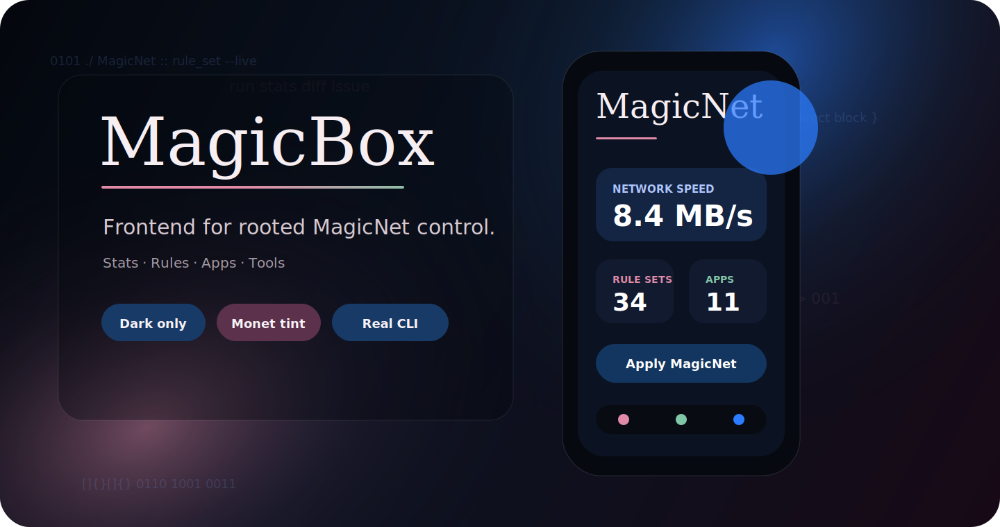
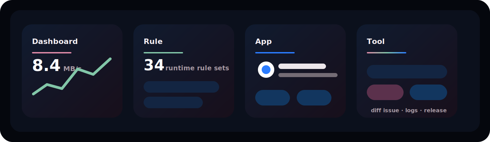
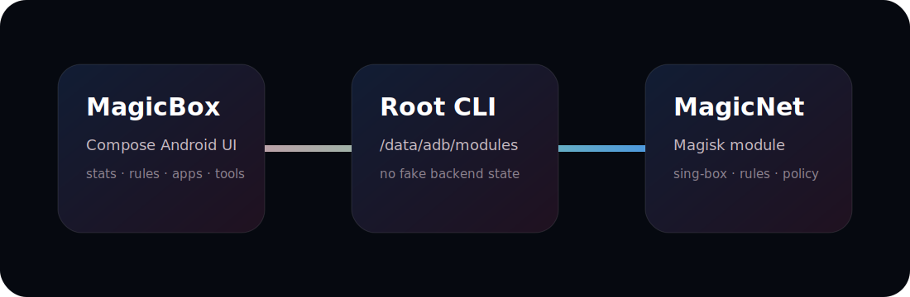

# MagicBox

<p align="center">
  
</p>

<p align="center">
  <a href="https://github.com/LIghtJUNction/MagicBox/actions/workflows/android.yml"></a>
  <a href="https://github.com/LIghtJUNction/MagicBox/actions/workflows/release.yml"></a>
  <a href="https://github.com/LIghtJUNction/MagicBox/releases"></a>
  <a href="LICENSE"></a>
</p>

<p align="center">
  <b>Dark Android frontend for the MagicNet Magisk module.</b><br>
  Built by <a href="https://github.com/LIghtJUNction">LIghtJUNction</a>.
</p>

<p align="center">
  <a href="https://github.com/LIghtJUNction/MagicBox/releases"><b>Download</b></a>
  ·
  <a href="docs/README.md"><b>Docs</b></a>
  ·
  <a href="docs/README_ZH_HANS.md"><b>中文</b></a>
  ·
  <a href="PRIVACY_POLICY.md"><b>Privacy</b></a>
</p>

<br>

<p align="center">
  
</p>

## What It Is

MagicBox is a thin, root-aware Android app for controlling an already installed
[MagicNet](https://github.com/LIghtJUNction/MagicNet) module.

```text
/data/adb/modules/MagicNet
```

It does not bundle a proxy core, Magisk backend, or hidden service. Every real
operation goes through the MagicNet CLI.

## Surface

| Dashboard | Rule | App | Tool |
| --- | --- | --- | --- |
| live stats, health, service control | custom suffixes + runtime rule sets | installed apps with icons | updates, diagnostics, issue drafts |

<p align="center">
  
</p>

## Install

1. Install MagicNet first.
2. Install MagicBox from [Releases](https://github.com/LIghtJUNction/MagicBox/releases).
3. Grant root permission.
4. Open `MagicNet` dashboard.

## Build

```bash
./gradlew :app:assembleDebug
adb install -r app/build/outputs/apk/debug/app-debug.apk
```

## Release

Use **Actions -> Release -> Run workflow**. The workflow bumps the version,
builds debug/release APKs, tags, and publishes GitHub Releases.

## Attribution

UI direction references [YumeBox](https://github.com/YumeYucca/YumeBox) by
YumeYucca. MagicBox keeps its own package name, icon, releases, issue tracker,
and MagicNet-only frontend scope.

## License

AGPL-3.0-or-later. See [LICENSE](LICENSE), [NOTICE.md](NOTICE.md), and
[docs/ThirdParty.md](docs/ThirdParty.md).
